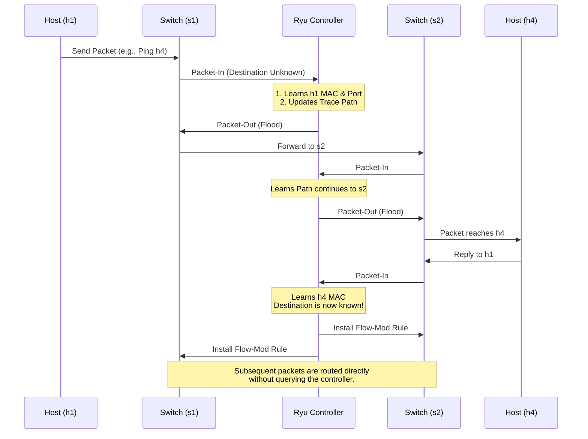

# SDN Path Tracing Tool

An interactive Software-Defined Networking (SDN) tool built using **Mininet** and the **Ryu Controller**. This tool acts as an intelligent learning switch, discovering the network topology, dynamically installing flow rules, and tracing the exact path of packets as they travel across multiple switches.

## 🌟 Features

- **Dynamic MAC Learning**: The controller automatically learns MAC-to-port mappings as packets traverse the network.
- **Reactive Flow Installation**: Installs OpenFlow 1.3 rules directly onto the switches to optimize subsequent communications.
- **Real-Time Path Tracing**: Visually outputs the packet paths directly in the controller console.
- **Path Logging**: Records all traced paths into a `logs/paths.csv` file for later analysis.
- **Custom Topology**: Includes a Mininet topology script simulating a multi-switch, multi-host environment.

---

## 🛠️ Prerequisites

Before running the project, ensure you have the following installed on your Linux environment:
- **Python 3** (and `pip`)
- **Mininet** (`sudo apt install mininet`)
- **Ryu SDN Framework** (`pip3 install ryu`)
- **Eventlet** (`pip3 install eventlet`)

---

## 📂 Project Structure

```text
.
├── controller/
│   └── path_tracer.py     # Ryu Controller App (handles path tracing, MAC learning, and flow installation)
├── topology/
│   └── topology.py        # Mininet custom topology (2 switches, 4 hosts)
├── logs/
│   └── paths.csv          # Output log containing recorded packet paths
├── patch_ryu.py           # Compatibility patch script (if needed for Ryu eventlet setup)
└── README.md              # Project documentation
```

---

## 🔄 How it Works (Workflow)



1. **Initialization**: The Mininet topology script spins up the network and connects the Open vSwitch (OVS) nodes to the Ryu controller.
2. **Packet-In Event**: When a host sends a packet (e.g., `h1` pings `h4`) and the switch doesn't know the destination, it forwards the packet to the Ryu controller via a `Packet-In` message.
3. **MAC Learning**: The controller inspects the packet, extracts the source MAC address, and maps it to the incoming port of that specific switch.
4. **Path Tracing**: As the packet traverses the switches, the controller builds and updates a trace path: `(Source MAC -> Switch 1 -> Switch 2 -> Destination MAC)`.
5. **Flow-Mod Installation**: Once the destination is known, the controller pushes an OpenFlow `Flow-Mod` rule directly to the switches. Future packets between these hosts are routed at line-rate by the switches without querying the controller.
6. **Logging**: The discovered path is printed to the console and appended to the `logs/paths.csv` file.

---

## 🚀 Run Instructions

You will need two separate terminal windows to run this tool.

### Terminal 1: Start the Ryu Controller
Start the Ryu controller with the custom path tracing application:
```bash
ryu-manager controller/path_tracer.py
```
*You should see a message indicating the controller has started and is waiting for switches.*

### Terminal 2: Run the Mininet Topology
In a new terminal, launch the custom network topology (requires `sudo`):
```bash
sudo python3 topology/topology.py
```
*This will create the network (Switches s1, s2 and Hosts h1, h2, h3, h4) and connect them to the controller.*

### Terminal 2: Test the Network
Once the Mininet CLI (`mininet>`) is active, generate traffic to trace the paths:

**Ping all hosts to populate the MAC tables:**
```bash
mininet> pingall
```

**Perform specific host-to-host pings:**
```bash
mininet> h1 ping h4
```

---

## 📊 Expected Output

As you generate traffic in Mininet, switch back to **Terminal 1** (the controller). You will see real-time path traces looking like this:

```
==================================================
 CLEAN SDN PATH TRACING STARTED 
==================================================

[SWITCH CONNECTED] S1
[SWITCH CONNECTED] S2
🔥 PATH: aa:bb → S1 → S2 → cc:dd
[FLOW] S1: 00:00:00:00:00:01 → 00:00:00:00:00:04 via port 3
```

All traced paths are automatically saved to `logs/paths.csv` for auditing and historical analysis.
